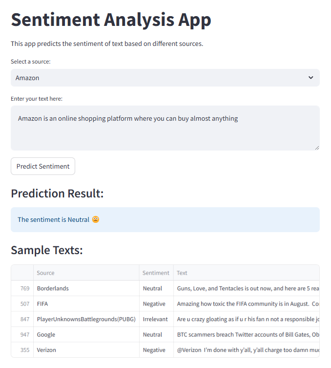

# Sentiment Analysis Project

This project implements a sentiment analysis application using machine learning & NLP and provides a user interface with Streamlit.

#Setup
1.clone the repository
2.Install the required pakages:
    pip install -r requirements.text
3.Place your twitter_training.csv and twitter_validation.csv files in the data/ directory.

# usage
1.Train the models:
    python src/sentiment_analysis.ipynb
2.Run the Streamlit app:
    streamlit run app.py
3.Open yours web browser and go to the URL provided by Streamlit(usally://localhost:8501).

# Project Structure

data/: Contains the training and validation datasets.
src/: Contains the source code for model training and prediction.
models/: Stores the trained models and vectorizers.
app.py: The main Streamlit application.
requirements.txt: List of Python dependencies.
